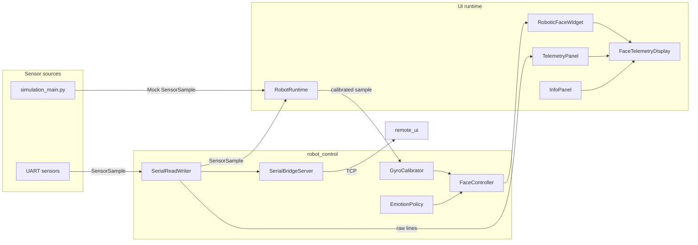

# Axon Runtime Architecture

This document explains how telemetry flows from the sensors (or simulator) into
the emotion engine, overlays, and Qt windows that operators see. The focus is
on the complete Axon runtime rather than the standalone face widget.

## High-level flow

- `SerialReadWriter` continuously drains UART frames and exposes the latest
  `SensorSample` to any consumer.
- `RobotRuntime` polls the reader, pushes samples through the
  `GyroCalibrator`, then asks `FaceController`/`EmotionPolicy` to update the
  `RoboticFaceWidget`.
- `SerialBridgeServer` mirrors every serial line and normalized telemetry to TCP
  clients such as `misc/remote_ui_main.py`.
- `FaceTelemetryDisplay` composes the face, telemetry, and info overlays.

## Entry points

| Entry point | Purpose | Primary modules |
|-------------|---------|-----------------|
| `simulation_main.py` | Desktop simulator with mock sensors, policy tuning, and remote bridge helpers. | `axon_ros.ui.SimulatorMainWindow`, `robot_control.EmotionPolicy`, `robot_control.GyroCalibrator` |
| `robot_main.py` | Fullscreen runtime on hardware. Connects to UART, auto-calibrates, and starts the TCP bridge. | `robot_control.SerialReadWriter`, `robot_control.SerialBridgeServer`, `axon_ros.runtime.RobotRuntime`, `axon_ros.runtime.RobotMainWindow` |
| `misc/remote_ui_main.py` | Lightweight desktop client that connects to the TCP bridge and renders the face + telemetry remotely. | `axon_ui.bridge_client.SerialBridgeClient`, `axon_ui.face_widget.RoboticFaceWidget` |

Each entry point registers its moving parts with `axon_ros.osi.OsiStack`. The
stack mimics OSI layers so diagnostics and ROS-style launchers can reason about
which component handles transport, session, and presentation responsibilities.

## Component responsibilities

### robot_control package

- **SerialReadWriter (`serial_reader.py`)** — owns the UART connection, parses
  JSON `SensorSample` frames, and forwards every raw line to registered
  consumers. The latest sample is stored atomically so polling loops can consume
  it without blocking the serial thread.
- **GyroCalibrator (`gyro_calibrator.py`)** — watches recent IMU data to learn
  yaw/pitch/roll offsets after the robot has been still for long enough. Once
  calibrated, it subtracts offsets before handing the sample to the face
  controller.
- **EmotionPolicy (`emotion_policy.py`)** — translates normalized motion and
  derived confidence scores into a discrete emotion target. The policy exposes
  hooks for idle states, dramatic transitions, and presets used by the simulator.
- **FaceController (`face_controller.py`)** — blends the calibrated sample and
  requested emotion into eyelid, brow, pupil, and mouth poses consumed by the
  widget.
- **SerialBridgeServer (`serial_bridge_server.py`)** — publishes telemetry over
  TCP and proxies any incoming command back to `SerialReadWriter.send_command`.
  Every connected client receives both structured frames (`telemetry {json}`)
  and the raw serial log.

### axon_ui package

- **RoboticFaceWidget** — renders the expressive face and exposes `set_emotion`
  plus orientation setters so external controllers can animate it.
- **TelemetryPanel** — shows live IMU, battery, and link status. It subscribes
  to raw serial lines from the runtime or mock sensors.
- **InfoPanel** — surfaces metadata such as robot IP and Wi-Fi SSID and emits
  a fullscreen toggle signal consumed by both entry points.
- **BridgeClient** — helper for the remote UI that understands the TCP framing
  provided by `SerialBridgeServer` and emits parsed telemetry signals.

### axon_ros runtime

`axon_ros.runtime.RobotRuntime` is a thin Qt-aware scheduler. It owns the
`SerialReadWriter`, `GyroCalibrator`, `FaceController`, and `SerialBridgeServer`
and ticks them on a timer (`poll_interval_ms`). `RobotMainWindow` wraps the
`FaceTelemetryDisplay`, exposes shutdown hooks, and enforces fullscreen kiosk
behavior on hardware. The simulator uses `axon_ros.ui.SimulatorMainWindow`, a
composite widget that embeds the same overlays but swaps the sensor source for a
mock generator and adds tabs for testing policies.

## Execution environments

| Environment | Sensor source | UI shell |
|-------------|---------------|---------|
| Simulator | `SimulatorMainWindow` synthesizes `SensorSample` frames and lets designers override yaw/pitch/roll and emotion presets. | Standard windowed Qt app sized to 1220×620 with docked tabs. |
| Robot | `SerialReadWriter` consumes UART frames, `SerialBridgeServer` mirrors telemetry, and `RobotRuntime` drives the kiosk window. | Fullscreen `RobotMainWindow` with overlays pinned to the top-right corner. |
| Remote UI | `axon_ui.bridge_client.SerialBridgeClient` subscribes to the TCP bridge and replays telemetry into the same overlays. | Desktop window identical to the simulator's Face tab. |

## Observability via OSI layers

`axon_ros.osi.describe_stack` renders the registered stack to logs so engineers
can confirm which component is bound to each layer (physical: serial port,
transport: TCP bridge, session: `RobotRuntime`, presentation/application: face
controller and windows). This standard vocabulary simplifies debugging across
process boundaries and prepares the project for ROS2 launch files.
